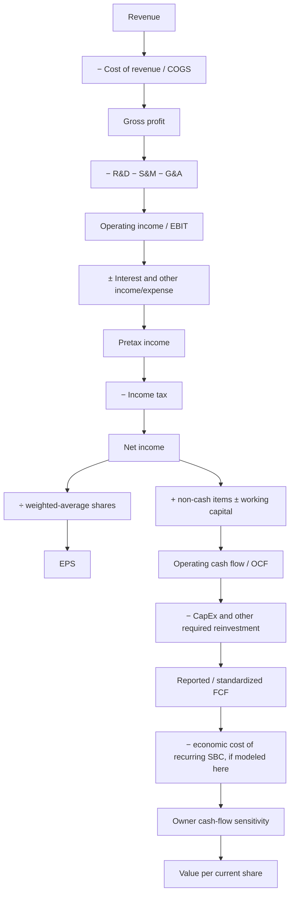
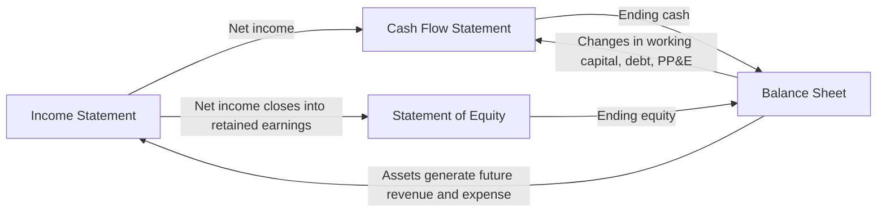

# Фінансовий аналіз: від Revenue до вартості на акцію

Це практичний довідник для повторення теорії фінансового аналізу публічної компанії. Він зібраний на основі всіх чатів проєкту `hypothesis`: аналізу Income Statement, Balance Sheet, Cash Flow, SBC, R&D, CapEx, ROIC/ROCE/ROE/WACC, маржинальності, SaaS KPI, peer comparison, yellow flags і valuation.

Повний очищений архів усіх ваших формулювань збережено окремо у [FINANCIAL_ANALYSIS_PROMPTS.md](./FINANCIAL_ANALYSIS_PROMPTS.md).

> Це навчальна методологія, а не інвестиційна рекомендація. Формули не замінюють читання 10-K/10-Q, приміток, reconciliation non-GAAP metrics і конкретної економіки бізнесу.

## 1. Головна карта: від продажу до цінності для акціонера



Кожен рівень відповідає на інше питання:

| Рівень | Головне питання |
|---|---|
| Revenue | Чи росте попит і наскільки якісне це зростання? |
| Gross profit | Скільки залишається після прямої вартості надання продукту? |
| Operating income | Чи масштабується операційна модель після R&D, продажів і адміністрації? |
| Net income | Що залишилося після фінансування, інших доходів/витрат і податків? |
| EPS | Яка частина прибутку припадає на одну акцію? |
| OCF | Скільки cash створила операційна діяльність у звітному періоді? |
| FCF | Скільки cash залишилося після визначеного набору капітальних витрат? |
| Owner economics | Що реально дісталося чинному акціонеру після dilution та інших claims? |
| Valuation | Скільки сьогодні варто заплатити за майбутній cash flow з урахуванням ризику? |

Ключова теза: **прибуток, cash flow і економічна цінність на акцію — пов’язані, але не тотожні поняття.**

## 2. Чотири фінансові звіти та зв’язок між ними

SEC виділяє чотири основні звіти: Balance Sheet, Income Statement, Cash Flow Statement і Statement of Shareholders’ Equity. Жоден окремий звіт не дає повної картини; їх треба читати разом. [SEC — Beginners’ Guide to Financial Statements](https://www.sec.gov/about/reports-publications/beginners-guide-financial-statements).

### Income Statement — звіт про прибутки та збитки

Показує доходи й витрати **за період** за accrual accounting: дохід або витрата визнаються тоді, коли вони зароблені чи понесені, а не обов’язково коли рухався cash.

### Balance Sheet — баланс

Показує стан **на конкретну дату**:

\[
Assets = Liabilities + Shareholders'\ Equity
\]

Це накопичений результат усіх попередніх операцій, фінансування, прибутків, збитків і розподілів капіталу.

### Cash Flow Statement — звіт про рух коштів

Пояснює, як змінився cash за період:

\[
Change\ in\ Cash = CFO + CFI + CFF + FX/Other
\]

- `CFO` або `OCF` — operating cash flow.
- `CFI` — investing cash flow.
- `CFF` — financing cash flow.

### Statement of Shareholders’ Equity

Пояснює зміну equity: net income, SBC, issuance, option exercises, dividends, buybacks, accumulated other comprehensive income та інші рухи.

### Наскрізні зв’язки



Приклади:

- Depreciation зменшує EBIT і net income, але не є поточним cash outflow, тому додається назад в OCF.
- Купівля PP&E зменшує cash і збільшує PP&E; у P&L потрапляє поступово через depreciation.
- Revenue, за який cash уже отриманий, але сервіс ще не наданий, створює deferred revenue liability.
- SBC зменшує GAAP income, додається назад в OCF як non-cash item і збільшує additional paid-in capital; пізніше може проявитися через dilution.

## 3. Income Statement: сходи від Revenue до Net Income

### 3.1 Revenue

Revenue — не сума отриманого cash, а вартість товарів або послуг, яку компанія визнала заробленою у звітному періоді.

Потрібно розкласти:

- reported і constant-currency growth;
- organic growth і внесок M&A;
- price, volume/usage і product mix;
- subscription, product, services та інші типи revenue;
- customer, product і geographic concentration;
- recurring проти transactional/cyclical revenue;
- annual, quarterly, TTM і CAGR.

Формули:

\[
YoY\ Growth_t = \frac{Revenue_t}{Revenue_{t-1}}-1
\]

\[
CAGR = \left(\frac{Revenue_n}{Revenue_0}\right)^{1/n}-1
\]

#### SaaS та consumption-based нюанс

Для SaaS revenue часто відстає від bookings і cash collection. Для consumption-моделі revenue швидше реагує на usage, оптимізацію клієнтів і сезонність. Тому разом із revenue дивляться ARR, NRR, GRR, RPO/cRPO, deferred revenue, billings, customer cohorts і product adoption.

### 3.2 Cost of revenue / COGS

Прямі витрати на надання продукту або послуги. Для software/SaaS це можуть бути:

- cloud hosting, compute, storage і third-party infrastructure;
- customer support та customer success, якщо класифіковані в cost of revenue;
- amortization capitalized internal-use software;
- amortization acquired technology;
- SBC працівників cost-of-revenue функцій;
- payment processing та інші прямі витрати.

Структура COGS між peers може різнитися. Нижча gross margin у compute-heavy платформи не автоматично означає слабший продукт.

### 3.3 Gross Profit і Gross Margin

\[
Gross\ Profit = Revenue - Cost\ of\ Revenue
\]

\[
Gross\ Margin = \frac{Gross\ Profit}{Revenue}
\]

Gross margin показує unit economics після прямої вартості delivery, але **сама по собі не доводить moat**. Вона залежить від product mix, infrastructure intensity, pricing, support model і бухгалтерської класифікації.

Дивитися треба на:

- рівень;
- тренд у percentage points;
- причину зміни;
- GAAP проти non-GAAP;
- total GM проти subscription/product GM;
- порівняння лише однаково визначених показників.

### 3.4 Operating expenses

Основні блоки:

- `R&D` — research and development;
- `S&M` — sales and marketing;
- `G&A` — general and administrative.

Для кожного корисно рахувати:

\[
Expense\ Ratio = \frac{Expense}{Revenue}
\]

Операційний leverage з’являється, коли revenue зростає швидше за OPEX, а OPEX/revenue знижується без руйнування майбутнього growth engine.

Не кожне зростання витрат є негативним:

- R&D може створювати майбутній продукт і moat;
- S&M може будувати ефективну distribution machine;
- G&A зазвичай має масштабуватися найраніше;
- скорочення R&D або S&M може тимчасово підняти margin, але пошкодити майбутнє зростання.

### 3.5 Operating Income / EBIT

\[
Operating\ Income = Gross\ Profit - Operating\ Expenses
\]

\[
Operating\ Margin = \frac{Operating\ Income}{Revenue}
\]

У типовому P&L `Operating Income` близький до EBIT, але визначення слід перевірити. GAAP operating margin включає SBC та інші операційні витрати. Тому високий SBC **знижує**, а не завищує GAAP operating margin.

### 3.6 EBITDA та Adjusted EBITDA

\[
EBITDA = EBIT + Depreciation + Amortization
\]

GAAP-подібний EBITDA все ще містить SBC. `Adjusted EBITDA` часто виключає SBC, restructuring, acquisition costs, amortization of acquired intangibles та інші статті — і тому є company-defined non-GAAP metric.

Питання до adjusted metric:

1. Чи справді exclusion non-recurring?
2. Чи повторюється він щороку?
3. Чи є це реальною економічною вартістю, навіть якщо не cash у поточному періоді?
4. Чи однаково компанія визначає показник у часі?
5. Чи можна так само нормалізувати peers?

### 3.7 Below the line: interest, other income, taxes

Після operating income йдуть:

- interest income;
- interest expense;
- gains/losses on investments or FX;
- gains/losses on debt extinguishment;
- other income/expense;
- income taxes.

\[
Pretax\ Income = Operating\ Income + Net\ Nonoperating\ Items
\]

\[
Net\ Income = Pretax\ Income - Income\ Tax
\]

Якщо cash-rich компанія має слабкий EBIT, але позитивний net income завдяки interest income, це не шахрайство. Це означає, що **core operating profitability і total shareholder earnings дають різні сигнали**.

Effective tax rate:

\[
ETR = \frac{Income\ Tax\ Expense}{Pretax\ Income}
\]

ETR нижче statutory rate не автоматично є red flag. Причини: geographic mix, tax credits, NOLs, valuation allowance, SBC tax windfalls, discrete items. Якщо pretax income малий або від’ємний, ETR може бути малоінформативним.

### 3.8 Net Income та EPS

Net income — прибуток усієї компанії після всіх витрат. `Earnings` у EPS — це не revenue і не gross/operating profit, а прибуток, доступний common shareholders після відповідних коригувань.

\[
Basic\ EPS = \frac{Net\ Income\ Available\ to\ Common}{Weighted\ Average\ Basic\ Shares}
\]

\[
Diluted\ EPS = \frac{Adjusted\ Net\ Income}{Weighted\ Average\ Diluted\ Shares}
\]

Для convertibles diluted EPS може потребувати `if-converted` коригування чисельника і знаменника. У збитковому періоді options/RSUs можуть бути anti-dilutive й не входити в diluted EPS, хоча економічний overhang нікуди не зникає.

Не плутати:

- period-end shares outstanding — стан на дату;
- weighted-average basic shares — середня кількість для EPS;
- diluted weighted-average shares — EPS denominator із потенційними акціями;
- fully diluted current shares — valuation input, визначення якого треба зафіксувати.

Для власника важливо:

\[
EPS\ Growth \approx Net\ Income\ Growth - Share\ Count\ Growth
\]

Це приблизна інтуїція, не точна тотожність.

## 4. Усі основні види маржинальності

| Маржа | Формула | Що показує | Головний нюанс |
|---|---|---|---|
| Gross margin | Gross profit / Revenue | Економіка delivery | Різний product/infrastructure mix |
| Contribution margin | (Revenue − variable costs) / Revenue | Внесок після змінних витрат | Не стандартизована, часто не розкривається |
| EBITDA margin | EBITDA / Revenue | Результат до D&A, interest і tax | Не дорівнює cash flow |
| Adjusted EBITDA margin | Company-defined adjusted EBITDA / Revenue | Нормалізований погляд менеджменту | Часто виключає recurring SBC |
| Operating / EBIT margin | Operating income / Revenue | Прибутковість core operations | GAAP включає SBC; capitalization впливає |
| NOPAT margin | EBIT × (1−t) / Revenue | Післяподаткова операційна маржа | Потрібна нормалізована tax rate |
| Pretax margin | Pretax income / Revenue | Після financing та other items, до tax | Cash-rich firms мають interest income |
| Net margin | Net income / Revenue | Bottom-line profitability | Може залежати від nonoperating income |
| OCF margin | OCF / Revenue | Cash conversion операцій | SBC add-back і working capital |
| Reported FCF margin | Company FCF / Revenue | Company-defined cash after CapEx | Non-GAAP і різні визначення |
| Standardized FCF margin | Standardized FCF / Revenue | Peer-comparable cash metric | Потрібна єдина методика |
| FCFF margin | FCFF / Revenue | Cash flow для debt + equity | Має бути unlevered |
| Owner-FCF proxy margin | (FCF − recurring SBC proxy) / Revenue | Строга shareholder sensitivity | Не є reported cash flow |

### Margin ladder

Корисно будувати один ряд за 5–10 років:

```text
Gross margin
→ GAAP operating margin
→ NOPAT margin
→ net margin
→ OCF margin
→ reported FCF margin
→ owner-FCF sensitivity margin
```

Великий розрив між GAAP operating margin і FCF margin не є автоматично добрим чи поганим. Його треба пояснити через SBC, D&A, deferred revenue, working capital, capitalized software, interest, taxes та CapEx.

### Rule of 40

Не має єдиного стандарту:

\[
GAAP\ Rule\ of\ 40 = Revenue\ Growth + GAAP\ Operating\ Margin
\]

\[
Cash\ Rule\ of\ 40 = Revenue\ Growth + Standardized\ FCF\ Margin
\]

\[
Owner\ Sensitivity\ R40 = Revenue\ Growth + (FCF-SBC)/Revenue
\]

Показувати треба назву margin, період і методику. Інакше два `Rule of 40` можуть бути різними показниками з однаковою етикеткою.

## 5. GAAP і non-GAAP: як читати reconciliation

GAAP — базова звітна система. Non-GAAP — додатковий company-defined погляд, який має бути reconciled до найближчого GAAP показника. SEC наголошує на reconciliation і тому, що FCF зазвичай є non-GAAP liquidity measure. [SEC — Non-GAAP Financial Measures](https://www.sec.gov/rules-regulations/staff-guidance/corporation-finance-interpretations/non-gaap-financial-measures).

Типова SaaS reconciliation:

```text
GAAP operating income
+ SBC
+ amortization of acquired intangibles
+ acquisition/restructuring costs
± tax or other defined adjustments
= Non-GAAP operating income
```

Non-GAAP operating margin може бути корисним для:

- внутрішнього планування;
- оцінки витрат без volatile acquisition accounting;
- стабільної динаміки, якщо методика не змінюється;
- порівняння з guidance менеджменту.

Але він не показує повну owner economics, коли виключає регулярну SBC. Практичний підхід — тримати поруч:

1. GAAP operating margin.
2. Non-GAAP operating margin.
3. SBC/revenue.
4. Amortization/revenue.
5. Capitalized development/revenue.
6. Net dilution і buyback spending.

## 6. SBC: витрата, non-cash add-back і dilution

### 6.1 Що таке SBC

Stock-Based Compensation — оплата праці акціями, RSUs, options, ESPP та іншими equity awards. За GAAP compensation cost визнається у фінансових звітах за fair-value-based підходом і розподіляється між cost of revenue, R&D, S&M та G&A. SEC прямо описує принцип визнання share-based compensation at fair value. [SEC Staff Accounting Bulletin No. 107](https://www.sec.gov/rules-regulations/staff-guidance/staff-accounting-bulletins/staff-accounting-bulletin-no-107).

### 6.2 Чому SBC додається назад в OCF

Спрощений indirect cash-flow bridge:

\[
OCF = Net\ Income + Noncash\ Charges \pm Working\ Capital
\]

SBC уже зменшила GAAP net income, але не спричинила equivalent current-period cash payment. Тому її додають назад. Це **не нове джерело cash**; це скасування non-cash expense у reconciliation.

### 6.3 Чому FCF може завищувати owner economics

Якщо:

\[
Reported\ FCF = OCF - CapEx
\]

то SBC, додана назад в OCF, зазвичай не віднімається нижче. Компанія з великою equity compensation може показувати сильний cash FCF, але чинні shareholders платять через:

- нові акції та dilution;
- використання cash на buybacks для компенсації issuance;
- claims уже виданих options/RSUs на майбутню equity value.

### 6.4 Owner-FCF sensitivity

Корисна сувора чутливість:

\[
Owner\ FCF\ Proxy = Reported\ FCF - Total\ SBC
\]

Де:

\[
Total\ SBC = Expensed\ SBC + Capitalized\ SBC
\]

Місток:

```text
Reported FCF
− expensed SBC
= FCF treating P&L SBC as an economic cost
− capitalized SBC
= broader owner-FCF sensitivity
```

Чому це лише proxy:

- SBC expense оцінюється на grant date, а не дорівнює ринковій вартості фактичного dilution;
- vesting, forfeitures, stock price й award mix змінюють результат;
- buybacks можуть приховувати gross issuance, але витрачають cash;
- unvested awards та options є окремим equity overhang;
- capitalized SBC визнаватиметься через amortization пізніше.

Отже, `FCF − SBC` не замінює reported FCF. Перше — owner-economics sensitivity, друге — liquidity/cash-generation measure.

### 6.5 Як не зробити double count у DCF

Потрібно послідовно розділити:

- **майбутні grants** — або як compensation cost у forecast cash flow, або через forecast dilution/buyback cash cost;
- **вже видані awards/options** — як existing claim on equity, окремо від майбутніх grants.

Не можна бездумно відняти весь майбутній SBC із FCF, закласти повну майбутню dilution ще раз, а потім ще повністю відняти option overhang. Damodaran розділяє already granted options та очікувані майбутні grants. [Damodaran — Management Options and Value](https://pages.stern.nyu.edu/~adamodar/New_Home_Page/valquestions/mgtoption.htm).

### 6.6 SBC dashboard

Мінімальний набір:

- total SBC і SBC/revenue;
- expensed проти capitalized SBC;
- SBC/OCF і SBC/reported FCF;
- period-end basic share growth;
- diluted share growth;
- gross equity issuance;
- buyback cash spent;
- net share-count change;
- unrecognized SBC та remaining recognition period;
- unvested awards/options overhang;
- owner-FCF proxy.

Поріг `SBC > 10% of net income` слабкий, коли net income близький до нуля. Для SaaS стабільніші denominators — revenue, gross profit, OCF і FCF.

## 7. Cash Flow Statement

### 7.1 OCF / CFO

За indirect method:

```text
Net income
+ D&A
+ SBC
+ impairments and other non-cash charges
− non-cash gains
± operating working-capital changes
= Operating cash flow
```

SEC зазначає, що cash-flow analysis допомагає пояснити різницю між net income і cash receipts/payments та потребу в зовнішньому фінансуванні. [SEC — The Statement of Cash Flows](https://www.sec.gov/newsroom/speeches-statements/munter-statement-cash-flows-120423).

### 7.2 Working capital: знак має значення

Спрощено:

\[
Operating\ NWC = AR + Inventory + Other\ Operating\ Current\ Assets - AP - Accruals - Deferred\ Revenue
\]

\[
Increase\ in\ Operating\ NWC \Rightarrow Cash\ Use
\]

| Зміна | Типовий cash effect | Інтуїція |
|---|---:|---|
| Accounts receivable ↑ | Outflow | Revenue визнаний, cash ще не отриманий |
| Inventory ↑ | Outflow | Cash вкладено в товар до продажу |
| Prepaids ↑ | Outflow | Сплачено раніше за expense recognition |
| Deferred contract costs ↑ | Outflow | Комісії виплачені, expense відкладено |
| Accounts payable ↑ | Inflow | Постачальникам ще не заплачено |
| Accrued liabilities ↑ | Inflow | Expense визнано, cash ще не сплачений |
| Deferred revenue ↑ | Inflow | Cash отримано до revenue recognition |

Working-capital inflow може бути якісним наслідком передплати, тимчасовим timing benefit або ознакою відкладених платежів. Один квартал не можна автоматично екстраполювати.

### 7.3 Profit-to-cash quality

`OCF > Net income` не завжди означає високу quality earnings. Потрібно пояснити gap:

- D&A після минулого CapEx;
- SBC;
- deferred revenue;
- receivables і collections;
- deferred contract costs;
- taxes;
- restructuring cash payments;
- interest income/expense;
- capitalized development.

Сильні перевірки:

\[
Cash\ Conversion = \frac{OCF}{Net\ Income}
\]

Цей ratio непридатний, якщо net income малий або від’ємний. Тоді краще дивитися OCF/revenue, OCF−SBC sensitivity і багаторічний bridge.

### 7.4 Investing cash flow / CFI

Типові рядки:

- purchases/sales of PP&E;
- capitalized software development;
- acquisitions net of cash acquired;
- purchases/sales/maturities of marketable securities;
- purchases/sales of businesses, intangibles чи investments.

Глибоко негативний CFI не обов’язково означає великий productive CapEx. Cash-rich SaaS може переводити cash у marketable securities. Це інвестиційний cash outflow у класифікації, але не знищення ліквідності.

### 7.5 Financing cash flow / CFF

Типові рядки:

- debt issuance і repayment;
- convertible notes;
- equity issuance;
- option exercises та ESPP proceeds;
- dividends;
- buybacks;
- finance lease principal;
- capped calls та інші financing arrangements.

Нулькупонний convertible не є безкоштовним: є issuance costs, potential dilution, conversion economics і, можливо, capped-call cash cost.

### 7.6 Види FCF

#### Company-defined FCF

Найчастіше:

\[
FCF = OCF - Purchases\ of\ PP\&E
\]

Для software-компанії консервативніше:

\[
Standardized\ FCF = OCF - PP\&E\ CapEx - Capitalized\ Software
\]

За потреби також враховують principal lease payments та інші required recurring investments. FCF не є GAAP і може відрізнятися між компаніями; SEC прямо описує типовий FCF як OCF мінус CapEx і вимагає розуміти reconciliation. [SEC — Non-GAAP Financial Measures](https://www.sec.gov/rules-regulations/staff-guidance/corporation-finance-interpretations/non-gaap-financial-measures).

#### FCFF — Free Cash Flow to Firm

\[
FCFF = EBIT(1-t) + D\&A - CapEx - \Delta Noncash\ NWC
\]

Еквівалентно:

\[
FCFF = NOPAT - Net\ Reinvestment
\]

Це pre-debt/unlevered cash flow для debt і equity claimholders. Його дисконтують за WACC і порівнюють з Enterprise Value. [Damodaran — Financial Measures & Ratios](https://pages.stern.nyu.edu/~adamodar/New_Home_Page/definitions.html).

#### FCFE — Free Cash Flow to Equity

\[
FCFE = Net\ Income + D\&A - CapEx - \Delta NWC + Net\ Borrowing
\]

Це cash flow для equity після debt flows. Його дисконтують за Cost of Equity і порівнюють з Equity Value.

#### Owner-FCF proxy

\[
Owner\ FCF\ Proxy = Standardized\ FCF - Recurring\ SBC\ Proxy
\]

Це аналітична sensitivity, а не cash-flow statement line.

### 7.7 Правильне pairing у valuation

| Value у чисельнику | Cash flow у знаменнику/DCF | Discount rate |
|---|---|---|
| Enterprise Value | FCFF / unlevered FCF | WACC |
| Equity Value | FCFE або levered company FCF | Cost of Equity |
| Market Cap | NTM levered FCF | Equity FCF yield / P/FCF |

`EV / company-defined FCF` часто логічно неузгоджений, бо company FCF зазвичай levered і містить interest. Для cash-rich SaaS помилка ще більша: cash віднімається з EV, а interest income від цього cash підвищує CFO/FCF.

## 8. CapEx, PP&E, depreciation та maintenance investment

### 8.1 PP&E

`Property, Plant & Equipment` — матеріальні довгострокові операційні активи. У балансі:

\[
Net\ PP\&E = Gross\ PP\&E - Accumulated\ Depreciation - Impairment
\]

Купівля PP&E — cash CapEx у CFI. У P&L вона потрапляє поступово через depreciation.

### 8.2 Depreciation і amortization

- Depreciation — списання матеріальних активів.
- Amortization — списання нематеріальних активів або capitalized software.

Обидва зменшують earnings, але не є cash outflow поточного періоду, тому за indirect method додаються назад в OCF.

### 8.3 CapEx проти D&A

\[
Net\ Capital\ Investment = CapEx - D\&A
\]

Інтуїція:

- `CapEx > D&A` часто відповідає growth/reinvestment;
- `CapEx ≈ D&A` може відповідати steady-state replacement;
- `CapEx < D&A` може означати asset harvesting, asset-lighting або просто accounting timing.

Але D&A — слабкий автоматичний proxy maintenance CapEx, особливо при inflation, acquisitions, software capitalization і різних useful lives.

### 8.4 Maintenance проти growth CapEx

Компанії рідко дають точну розбивку. Використовують:

- management disclosure;
- asset replacement schedules;
- depreciation як грубий mature-state anchor;
- historical CapEx/sales і capacity growth;
- physical capacity, unit counts або infrastructure metrics;
- sensitivity range, а не одну «точну» цифру.

Для cloud/SaaS значна частина infrastructure spend може проходити як hosting OPEX, а не CapEx. Тому низький CapEx не завжди означає відсутність reinvestment.

## 9. R&D і capitalized software

### 9.1 Accounting view

Більшість R&D у US GAAP визнається expense одразу через невизначеність майбутньої вигоди. Частина internal-use software після виконання критеріїв може capitalized, потім amortized.

Не можна просто сказати: «все R&D створює майбутню цінність, отже все потрібно капіталізувати». Частина R&D:

- підтримує існуючий продукт;
- не приводить до комерційного результату;
- швидко застаріває;
- є research, а не development із доведеною future benefit.

### 9.2 Economic/Damodaran view

Damodaran пропонує для аналітики reclassify R&D як інвестицію, створити research asset і amortize його протягом економічного життя. [Damodaran — A Financial Analysis of R&D Expenses](https://pages.stern.nyu.edu/~adamodar/New_Home_Page/valquestions/R%26D.htm).

Кроки:

1. Обрати amortizable life — наприклад 3, 5 або 8 років залежно від product cycle.
2. Зібрати історичний R&D за цей період.
3. Розрахувати unamortized portion кожного vintage.
4. Скласти research asset.
5. Визначити поточну amortization research asset.
6. Перерахувати EBIT і invested capital.

За straight-line assumption:

\[
Research\ Asset_t = \sum_{i=0}^{n-1} R\&D_{t-i}\times\left(1-\frac{i}{n}\right)
\]

У моделі tax treatment має бути послідовним; деякі реалізації будують after-tax research asset.

\[
Adjusted\ EBIT = Reported\ EBIT + Current\ R\&D - R\&D\ Amortization
\]

\[
Adjusted\ Invested\ Capital = Reported\ Invested\ Capital + Research\ Asset
\]

\[
Adjusted\ ROIC = \frac{Adjusted\ EBIT(1-t)}{Average\ Adjusted\ Invested\ Capital}
\]

### 9.3 Чому R&D capitalization сильно змінює ROIC

Reported accounting одночасно:

- зменшує current EBIT усім R&D;
- не показує створений research asset у capital base.

Reclassification додає назад current R&D, віднімає amortization і збільшує invested capital. Для швидко зростаючого R&D current expense часто більший за amortization старих vintages, тому adjusted EBIT зростає. Але denominator теж зростає.

### 9.4 Чи створює capitalization більше FCF

Ні. Це **reclassification, а не створення cash**.

У послідовній FCFF-моделі:

- adjusted EBIT стає вищим;
- current R&D мінус amortization входить у reinvestment;
- cash flow не повинен механічно збільшитися лише від зміни етикетки.

### 9.5 Чому 3, 5 або 8 років

Це estimate економічного життя, не бухгалтерська істина:

- fast-moving application software: частіше коротше;
- платформні інвестиції: інколи довше;
- pharma/biotech: потенційно значно довше;
- нестабільна технологія: коротше.

Правильний підхід — sensitivity 3/5/7 років і перевірка, чи висновок про ROIC зберігається.

### 9.6 Capitalized software як зона judgment

Capitalization знижує current OPEX і підвищує current EBIT, а expense переноситься у future amortization. Cash FCF не повинен поліпшуватись, якщо company-defined FCF віднімає capitalized software outflow.

Моніторити:

- capitalized software / total R&D;
- capitalized software / revenue;
- темп capitalized software проти R&D;
- amortization / capitalized additions;
- зміни useful life;
- impairment;
- consistency policy між періодами;
- capitalized SBC у складі software asset.

Зміна useful life з 2 до 3 років зменшує annual amortization і підвищує current earnings, але не змінює початковий cash outflow.

## 10. Balance Sheet: ліквідність, якість активів і claims

### 10.1 Assets

Основні групи:

- cash and cash equivalents;
- marketable securities;
- accounts receivable;
- inventory;
- prepaids та other current assets;
- PP&E;
- capitalized software та інші intangibles;
- goodwill;
- deferred tax assets;
- operating lease right-of-use assets;
- investments та інші nonoperating assets.

Cash-only test може бути оманливим, якщо значна ліквідність зберігається у short-term marketable securities. Потрібно показувати обидва:

```text
Cash vs debt
Cash + marketable securities vs debt
```

### 10.2 Liabilities

- accounts payable;
- accrued expenses;
- deferred revenue;
- short- і long-term debt;
- convertible notes;
- operating/finance lease liabilities;
- deferred tax liabilities;
- contingent consideration;
- other claims.

Deferred revenue — це і джерело advance funding, і obligation надати сервіс. Не можна додавати його до cash як окрему ліквідність: cash від prepayment уже на балансі.

### 10.3 Equity

Основні компоненти:

- common stock;
- additional paid-in capital;
- retained earnings / accumulated deficit;
- accumulated other comprehensive income;
- treasury stock.

Negative retained earnings у growth-компанії не дорівнює insolvency. Потрібно дивитися total equity, liquidity, cash burn, debt maturities та operating economics.

### 10.4 Goodwill та intangibles

Goodwill виникає, коли purchase price придбання перевищує fair value identifiable net assets.

Goodwill impairment:

- зменшує goodwill asset;
- зменшує operating income/net income та equity;
- зазвичай є non-cash у періоді списання;
- додається назад в OCF indirect reconciliation;
- сигналізує, що минула acquisition economics виявилася гіршою за очікування;
- не обов’язково зменшує tax base — tax treatment залежить від структури угоди й jurisdiction.

«Non-cash write-down» не означає, що втрати не було. Cash або shares були витрачені під час acquisition раніше; impairment визнає зниження очікуваної recoverable value тепер.

Корисні погляди:

- goodwill / total assets;
- goodwill / equity;
- tangible book value;
- ROIC including goodwill — capital allocation record менеджменту;
- ROIC excluding goodwill — organic operating asset economics.

### 10.5 Liquidity та leverage ratios

\[
Current\ Ratio = \frac{Current\ Assets}{Current\ Liabilities}
\]

\[
Quick\ Ratio = \frac{Cash + Marketable\ Securities + Receivables}{Current\ Liabilities}
\]

\[
Net\ Debt = Debt - Cash - Eligible\ Nonoperating\ Securities
\]

\[
Debt/Equity = \frac{Interest\ Bearing\ Debt}{Shareholders'\ Equity}
\]

\[
Net\ Debt/EBITDA = \frac{Net\ Debt}{EBITDA}
\]

\[
Interest\ Coverage = \frac{EBIT}{Interest\ Expense}
\]

Для net-cash або negative-EBIT компаній деякі ratios не мають нормального економічного сенсу. Convertible debt також потребує окремого аналізу conversion price, maturity, settlement method і capped calls.

### 10.6 Stress test

Стрес повинен бути cash-based, а не лише P&L-based:

1. Revenue shock.
2. Gross-margin shock.
3. Частка variable проти fixed OPEX.
4. Cash payroll, hosting, leases, tax і debt maturity.
5. Working-capital reversal.
6. CapEx і committed obligations.
7. Available cash/securities і external financing.

Runway:

\[
Runway\ Months = \frac{Available\ Net\ Liquidity}{Monthly\ Cash\ Burn}
\]

SBC не є current cash payroll, тому P&L OPEX не можна механічно приймати за cash burn.

## 11. Capital Employed, ROE, ROCE, ROIC і WACC

### 11.1 ROE

\[
ROE = \frac{Net\ Income\ to\ Common}{Average\ Common\ Equity}
\]

Відповідає: яку accounting return компанія заробила на common book equity.

DuPont:

\[
ROE = Net\ Margin \times Asset\ Turnover \times Equity\ Multiplier
\]

Високий ROE може виникнути через:

- високу margin;
- ефективне використання assets;
- високий leverage;
- buybacks, що зменшують equity;
- дуже малий або негативний denominator.

Порівнювати логічно з Cost of Equity, а не WACC.

### 11.2 ROCE

Один поширений варіант:

\[
ROCE = \frac{EBIT}{Average\ Capital\ Employed}
\]

\[
Capital\ Employed = Total\ Assets - Current\ Liabilities
\]

Альтернативно використовують equity + long-term debt. ROCE часто pre-tax і має неоднакові definitions, тому методику треба фіксувати.

### 11.3 ROIC

\[
ROIC = \frac{NOPAT}{Average\ Invested\ Capital}
\]

\[
NOPAT = Normalized\ EBIT \times (1-Normalized\ Tax\ Rate)
\]

Операційний підхід:

\[
Invested\ Capital = Operating\ Assets - Noninterest\ Bearing\ Operating\ Liabilities
\]

Фінансовий підхід:

\[
Invested\ Capital = Equity + Debt + Preferred + NCI - Excess\ Cash - Nonoperating\ Investments
\]

Обидва мають приблизно зійтися після послідовної класифікації.

ROIC decomposition:

\[
ROIC = NOPAT\ Margin \times Invested\ Capital\ Turnover
\]

Важливі коригування:

- average beginning/end capital, а не лише ending balance;
- excess cash;
- operating leases;
- goodwill, залежно від питання;
- capitalized R&D;
- restructuring та one-offs;
- normalized tax rate;
- acquisition timing;
- accumulated impairments.

Для net-cash asset-light SaaS reported invested capital може бути дуже малим або негативним. Тоді ROIC вибухає, змінює знак або стає малоінформативним. Потрібні reported, operating і R&D-adjusted views.

### 11.4 WACC

\[
WACC = \frac{E}{D+E}R_e + \frac{D}{D+E}R_d(1-T)
\]

За наявності preferred stock додається відповідна вага.

Cost of equity через CAPM:

\[
R_e = R_f + \beta \times ERP + Country\ Risk\ Premium
\]

Cost of debt — поточна marginal borrowing rate, а не обов’язково історичний coupon. Ваги — market values. Tax shield не слід механічно давати компанії, яка не може його використовувати.

### 11.5 Value creation

\[
Value\ Creation\ Spread = ROIC - WACC
\]

\[
Economic\ Profit = (ROIC-WACC)\times Invested\ Capital
\]

\[
Expected\ Growth \approx Reinvestment\ Rate \times Return\ on\ New\ Invested\ Capital
\]

Не достатньо мати високий historical ROIC. Важливо:

- скільки нового capital можна реінвестувати;
- який incremental ROIC;
- як довго збережеться spread;
- чи не закладена вся якість у valuation.

## 12. Revenue quality та SaaS KPI

### ARR

Annual Recurring Revenue — annualized recurring run-rate. Це не GAAP revenue і company definitions можуть відрізнятися.

### NRR / NDR

\[
NRR = \frac{Starting\ ARR - Churn - Contraction + Expansion}{Starting\ ARR}
\]

Показує durability плюс expansion існуючої бази.

### GRR

\[
GRR = \frac{Starting\ ARR - Churn - Contraction}{Starting\ ARR}
\]

GRR не дозволяє expansion компенсувати churn. Разом:

- GRR — наскільки добре база утримується;
- NRR — наскільки вона розширюється.

### Churn

Може вимірюватися logo churn або revenue churn. Місячний і річний churn не можна порівнювати без перерахунку.

### RPO і cRPO

Remaining Performance Obligations — contracted revenue, який ще не визнаний. `cRPO` — частина, яку очікують визнати протягом найближчих 12 місяців. RPO залежить від contract duration, billing terms і multi-year mix; це не те саме, що revenue або ARR.

### Billings і deferred revenue

Спрощено:

\[
Billings \approx Revenue + \Delta Deferred\ Revenue
\]

Але company definitions можуть додавати contract assets та інші коригування. Billings volatile через timing великих угод.

### Product adoption і customer cohorts

Для platform SaaS важливі:

- customers using 2+/4+/6+/8+/10+ products;
- customers above ARR thresholds;
- total customers і net adds;
- cohort retention;
- usage intensity;
- product ARR milestones;
- enterprise vs SMB mix.

Ці KPI є leading indicators cross-sell, switching costs і майбутнього NRR, але не замінюють revenue та cash economics.

### Segment/product margins

Якщо компанія звітує як один segment і не дає product revenue/COGS, точну product margin порахувати неможливо. Правильні альтернативи:

- використовувати disclosed ARR thresholds і pricing;
- розкладати cost drivers;
- будувати scenario allocation;
- чітко позначати `Reported`, `Derived`, `Directional`, `Not disclosed`;
- не малювати точний revenue pie або margin, якого джерела не підтримують.

## 13. Peer comparison: яблука з яблуками

### 13.1 Різні peer sets для різних питань

- Direct product competitors — NRR, product breadth, win rates, pricing, feature quality.
- Business-model peers — growth, gross margin, operating leverage, SBC, FCF.
- Valuation peers — growth/margin/duration/risk, а не лише схожий product label.
- Capital-structure peers — leverage, maturity, liquidity.

Одна компанія не обов’язково є правильним peer для всіх метрик.

### 13.2 Standardization checklist

1. Одна as-of date.
2. Одна currency і units.
3. Calendarized NTM.
4. LTM actuals, а не змішані FY/Q.
5. Total revenue до total revenue.
6. GAAP GM до GAAP GM однакового scope.
7. GAAP operating margin поруч із SBC.
8. Standardized FCF: однаковий CapEx/software/lease treatment.
9. Period-end fully diluted share logic.
10. Organic/constant-currency adjustments.
11. Одна consensus source/date.
12. Чітке treatment convertibles і excess cash.

### 13.3 Порівнюваність метрик

| Метрика | Порівнюваність | Що нормалізувати |
|---|---|---|
| Revenue growth | Висока | Organic, FX, acquisitions, product scope |
| NTM growth | Середньо-висока | Consensus date, fiscal calendar, definition |
| Gross margin | Середня | Total/product/subscription mix, infrastructure |
| GAAP operating margin | Середньо-висока | SBC, amortization, capitalization, one-offs |
| FCF margin | Середня | CapEx, software, leases, working capital, SBC |
| Rule of 40 | Середня | Version of growth і margin |
| SBC/revenue | Середньо-висока | Grant mix, acquisitions, vesting lag |
| Dilution | Висока після нормалізації | Buybacks, anti-dilutive awards, period-end shares |
| EV/NTM Revenue | Середньо-висока | Fully diluted EV, cash/debt date, NTM source |
| EV/FCFF | Висока за правильної FCFF | Unlevered cash flow |
| Equity/FCF | Висока за однакового FCF | Levered FCF definition |

## 14. Earnings quality та yellow flags

Threshold — це screen, не verdict. Для кожного flag потрібні `Fact → Mechanics → Context → Trend`.

### Revenue та receivables

- AR росте швидше revenue.
- DSO погіршується.
- Allowance for credit losses не відповідає risk.
- Revenue growth тримається лише acquisition або one customer.
- RPO growth пояснюється довшою duration, а не demand.

### Margins та expenses

- Revenue ↑, gross margin ↓.
- Gross profit ↑, operating profit не масштабується.
- S&M росте швидше revenue без покращення growth/retention.
- Frequent «one-time» exclusions.
- Useful-life extensions або capitalization ratio різко змінюються.

### Below the line і taxes

- Net income позитивний лише завдяки interest/other income.
- One-time gains маскують слабкий EBIT.
- ETR volatile без пояснення.
- Tax benefits від SBC підтримують EPS.

### Cash flow

- OCF систематично нижче NI.
- OCF підтримується persistent payable/accrual build.
- Deferred revenue inflow приймається за вічний boost.
- FCF сильний лише через скорочення CapEx.
- M&A recurring, але виключений з «normalized» FCF.
- SBC є основним мостом NI → OCF.

### Balance sheet

- cash declining при rising debt;
- debt maturity concentration;
- receivables/inventory outgrow business;
- goodwill/intangibles dominate assets/equity;
- negative tangible equity;
- covenant, lease або contingent obligations;
- large off-balance-sheet commitments.

### Shares та governance

- net dilution висока;
- buybacks маскують gross issuance;
- buybacks фінансуються debt;
- auditor change, restatement або adverse opinion;
- Critical Audit Matter — зона judgment, але не доказ misstatement;
- management departures або related-party transactions.

### Слабкі автоматичні правила

- `Goodwill > 50% assets` — корисний screen, але не універсальний ризик-поріг.
- `CapEx > 25% net income` — поганий denominator при низькому NI.
- `SBC > 10% net income` — нестабільний для near-breakeven SaaS.
- `OCF < NI` один квартал — може бути сезонний working capital.
- `Cash < debt` — ігнорує marketable securities та maturities.

Краще аналізувати 5–10 років і використовувати revenue, gross profit, OCF, FCF та capital base як альтернативні denominators.

## 15. Valuation: як фінансова теорія переходить у ціну

### 15.1 Enterprise Value bridge

\[
Enterprise\ Value = Equity\ Value + Debt + Preferred + NCI - Cash - Nonoperating\ Investments
\]

\[
Equity\ Value = Operating\ Asset\ Value + Cash + Nonoperating\ Assets - Debt - Other\ Claims
\]

Options, RSUs, convertibles, litigation, underfunded pensions та contingent consideration можуть бути додатковими claims.

### 15.2 DCF drivers

Будь-який DCF — це чотири системи припущень:

1. Growth.
2. Margins.
3. Reinvestment і return on capital.
4. Risk / discount rate.

Terminal value не має бути plug. Terminal growth, margin, reinvestment і ROIC повинні бути внутрішньо узгоджені.

Damodaran формулює growth як функцію reinvestment rate і return on capital. [Damodaran — Introduction to Valuation](https://pages.stern.nyu.edu/~adamodar/New_Home_Page/background/valintro.htm).

### 15.3 Cash-rich company і double count

Для core FCFF:

- interest income з excess cash не має входити в operating EBIT/FCFF;
- excess cash додається окремо в EV-to-equity bridge.

Інакше cash може бути врахований двічі: interest підвищує cash flow, а сам cash ще додається до equity value.

### 15.4 Multiples

- EV/NTM Revenue — корисний для early/high-growth firms, але читати разом із growth, GM, margins, SBC і durability.
- EV/EBITDA — потребує однакового EBITDA і capital intensity.
- EV/FCFF — для unlevered FCF.
- Equity Value/FCF або P/FCF — для levered company FCF.
- FCF yield = NTM FCF / Equity Value.
- P/E — залежить від accounting earnings, capital structure та tax.

Високоякісний бізнес може бути слабкою інвестицією за надмірної ціни. І навпаки, низький multiple не компенсує структурне руйнування cash flow без достатнього margin of safety.

## 16. Періоди, джерела і модельна дисципліна

### 16.1 Annual, quarterly, YTD і TTM

\[
TTM = Latest\ FY + Current\ YTD - Prior\ Year\ Comparable\ YTD
\]

Для cash-flow statements 10-Q часто показує YTD, а не discrete quarter:

\[
Q2\ Discrete = H1\ YTD - Q1\ YTD
\]

\[
Q3\ Discrete = 9M\ YTD - H1\ YTD
\]

\[
Q4\ Discrete = FY - 9M\ YTD
\]

Типова помилка — порівняти YTD cash flow з окремим кварталом або сумувати cumulative figures.

### 16.2 Джерельна ієрархія

1. SEC filing та filing exhibits.
2. Earnings release/supplemental.
3. Investor presentation.
4. Earnings-call transcript.
5. Company website/pricing.
6. Consensus/market-data provider.
7. Secondary research.

Для кожного derived metric фіксувати:

- source ID/URL;
- filing period і filed date;
- page/section;
- units;
- numerator/denominator;
- formula;
- GAAP/company-defined/derived/analyst-adjusted;
- restatement або scope change;
- as-of date.

### 16.3 Не змішувати

- quarterly з annual;
- FY2025 із Q1 2026 без чіткої етикетки;
- reported з constant currency;
- basic із diluted shares;
- period-end із weighted-average shares;
- total GM із subscription GM;
- company FCF із standardized FCF;
- levered FCF із Enterprise Value;
- actuals із NTM consensus різних дат;
- marketable-securities purchases із productive CapEx.

## 17. Практичний workflow аналізу компанії

### Крок 1. Визначити питання

Не «проаналізувати все», а, наприклад:

- чи масштабується business model;
- чи headline FCF належить shareholders;
- чи balance sheet витримає stress;
- чи ROIC перевищує WACC;
- що вже закладено в valuation.

### Крок 2. Зафіксувати scope

- company/ticker/exchange;
- as-of date;
- annual/quarterly/TTM;
- 5–10 років history;
- reported і adjusted layers;
- primary sources.

### Крок 3. Revenue engine

- drivers, mix, concentration;
- organic/FX/M&A;
- ARR/NRR/GRR/RPO;
- customer/product adoption;
- lifecycle stage.

### Крок 4. Margin ladder

- gross;
- R&D/S&M/G&A ratios;
- GAAP/non-GAAP operating;
- net;
- OCF/FCF;
- SBC і owner sensitivity.

### Крок 5. Profit-to-cash bridge

- NI → OCF;
- SBC/D&A;
- working capital;
- OCF → standardized FCF;
- FCF deployment.

### Крок 6. Balance sheet

- cash + securities;
- debt/maturities/leases;
- receivables/deferred revenue;
- goodwill/intangibles;
- liquidity і stress test.

### Крок 7. Capital efficiency

- ROE/ROCE/ROIC;
- R&D-adjusted ROIC;
- incremental ROIC;
- ROIC−WACC;
- reinvestment rate.

### Крок 8. Shareholder economics

- EPS growth;
- SBC/revenue;
- gross issuance, buybacks, net dilution;
- per-share FCF/value;
- option/RSU overhang.

### Крок 9. Peers і valuation

- правильні peer sets;
- standardized metrics;
- DCF/base-bull-bear;
- multiple sensitivity;
- what must be true at current price.

### Крок 10. Falsifiers і monitoring

Завершити не rating, а списком:

- що підтверджує thesis;
- що її ламає;
- які KPI дивитися наступного кварталу;
- які accounting judgments можуть змінити висновок.

## 18. Як уникнути analytical paralysis

Оптимальна глибина — не максимум даних, а момент, коли нова інформація перестає змінювати decision.

Три шари:

### Layer 1 — 30–60 хвилин

- business model і lifecycle;
- revenue growth;
- gross/operating/FCF margins;
- SBC/dilution;
- balance-sheet liquidity;
- valuation snapshot;
- 3 головні ризики.

### Layer 2 — повний fundamental review

- 5–10 років statements;
- NI→OCF→FCF bridge;
- R&D/CapEx normalization;
- ROIC/WACC;
- peers;
- scenarios.

### Layer 3 — forensic deep dive

- footnotes, accounting estimates і policy changes;
- customer/product mix;
- acquisition accounting;
- tax/SBC/convertibles;
- source conflicts;
- exact model tie-out.

Stop rule: якщо новий факт не змінює forecast, risk range, required return, position sizing або falsifier — зафіксувати його, але не затримувати decision.

## 19. Найчастіші помилки

1. Вважати FCF «прибутком власника» без SBC/dilution analysis.
2. Називати SBC fake expense або, навпаки, прирівнювати GAAP SBC до exact cash cost.
3. Віднімати майбутню SBC з FCF і вдруге повністю карати valuation dilution.
4. Змішувати company FCF з FCFF.
5. Використовувати EV/levered FCF.
6. Включати interest income в core FCFF і ще раз додавати excess cash.
7. Вважати negative investing cash flow чистим CapEx.
8. Ігнорувати capitalized software.
9. Додавати deferred revenue до liquidity поверх cash.
10. Використовувати ending shares для EPS або weighted-average shares для period-end dilution.
11. Порівнювати total GM з subscription GM.
12. Приймати non-GAAP exclusions без recurring-cost test.
13. Вважати goodwill impairment «неважливим, бо non-cash».
14. Вважати current ratio достатнім без maturity/commitment analysis.
15. Рахувати ROIC на tiny/negative invested capital без пояснення.
16. Капіталізувати R&D і забувати додати research asset у denominator.
17. Підвищувати EBIT через R&D reclassification і не відображати reinvestment у FCFF.
18. Видавати product margins без product revenue/COGS disclosure.
19. Змішувати actual, guidance і consensus.
20. Робити висновок з одного кварталу без seasonality/LTM.

## 20. Формули: коротка шпаргалка

```text
Revenue growth = Revenue_t / Revenue_t-1 − 1
Gross profit = Revenue − COGS
Gross margin = Gross profit / Revenue
Operating income = Gross profit − OPEX
Operating margin = Operating income / Revenue
EBITDA = EBIT + D&A
Net margin = Net income / Revenue
Basic EPS = NI to common / weighted-average basic shares
Diluted EPS = adjusted NI / weighted-average diluted shares

OCF = NI + non-cash charges ± operating working capital
Standardized FCF = OCF − PP&E CapEx − capitalized software − other defined recurring capital outlays
FCFF = EBIT(1−t) + D&A − CapEx − Δ non-cash NWC
FCFE = NI + D&A − CapEx − ΔNWC + net borrowing
Owner-FCF proxy = Standardized FCF − recurring SBC proxy

Current ratio = Current assets / Current liabilities
Quick ratio = (Cash + securities + AR) / Current liabilities
Net debt = Debt − cash − eligible nonoperating securities
Interest coverage = EBIT / interest expense

ROE = NI to common / average common equity
ROCE = EBIT / average capital employed
NOPAT = normalized EBIT × (1−normalized tax rate)
ROIC = NOPAT / average invested capital
WACC = E/(D+E)×Re + D/(D+E)×Rd×(1−t)
Economic profit = (ROIC−WACC) × invested capital
Growth ≈ reinvestment rate × return on new invested capital

NRR = (starting ARR − churn − contraction + expansion) / starting ARR
GRR = (starting ARR − churn − contraction) / starting ARR
Billings ≈ Revenue + Δ deferred revenue

Enterprise value = Equity value + debt + preferred + NCI − cash − nonoperating investments
FCF yield = NTM levered FCF / equity value
```

## 21. Datadog як навчальний приклад: які уроки переносні

Без прив’язки до конкретної поточної ціни уроки з попередніх розборів такі:

- Strong reported FCF може співіснувати з low/volatile owner-FCF sensitivity через SBC.
- GAAP operating margin включає SBC; FCF додає її назад, тому обидва показники чесні, але відповідають на різні питання.
- Net income cash-rich SaaS може суттєво підтримуватися interest income, навіть якщо core operating income слабший.
- Capitalized software переносить expense у майбутню amortization; standardized FCF має віднімати cash outflow.
- R&D-adjusted ROIC корисний, бо software investment не повністю видно в balance sheet, але результат чутливий до assumed asset life.
- Product/sector margin не можна видавати за reported fact, якщо компанія не розкриває product revenue і COGS.
- NRR, GRR, product adoption і large-customer counts пояснюють quality of growth, але не замінюють margin та cash analysis.
- Cash + marketable securities треба відрізняти від cash-only; purchases of securities не є productive CapEx.
- Peer comparison потребує двох наборів: direct product peers для KPI та business-model peers для finance/valuation.

## 22. Джерела для повторення

- [SEC — Beginners’ Guide to Financial Statements](https://www.sec.gov/about/reports-publications/beginners-guide-financial-statements)
- [SEC — Non-GAAP Financial Measures](https://www.sec.gov/rules-regulations/staff-guidance/corporation-finance-interpretations/non-gaap-financial-measures)
- [SEC — The Statement of Cash Flows](https://www.sec.gov/newsroom/speeches-statements/munter-statement-cash-flows-120423)
- [SEC Staff Accounting Bulletin No. 107 — Share-Based Payment](https://www.sec.gov/rules-regulations/staff-guidance/staff-accounting-bulletins/staff-accounting-bulletin-no-107)
- [Damodaran — Financial Measures & Ratios](https://pages.stern.nyu.edu/~adamodar/New_Home_Page/definitions.html)
- [Damodaran — R&D Expenses](https://pages.stern.nyu.edu/~adamodar/New_Home_Page/valquestions/R%26D.htm)
- [Damodaran — Research Asset Primer](https://pages.stern.nyu.edu/adamodar/New_Home_Page/AccPrimer/research.htm)
- [Damodaran — Management Options and Value](https://pages.stern.nyu.edu/~adamodar/New_Home_Page/valquestions/mgtoption.htm)
- [Damodaran — Introduction to Valuation](https://pages.stern.nyu.edu/~adamodar/New_Home_Page/background/valintro.htm)

## 23. Повний архів ваших промптів

У [FINANCIAL_ANALYSIS_PROMPTS.md](./FINANCIAL_ANALYSIS_PROMPTS.md) збережено:

- усі 39 кореневих чатів цього проєкту;
- 243 user prompts;
- 205 унікальних очищених формулювань;
- довгі шаблони Deep Business Model, Management/CEO, Balance Sheet, Income Statement, Cash Flow і Yellow Flags;
- усі наступні уточнення про SBC, goodwill, EPS, non-GAAP margin, capitalized software, financing cash flow, ROIC/WACC, peers, KPI та візуалізацію;
- назви й шляхи вкладень;
- повторно використані prompts із переліком sessions.

Службові `environment_context`, `recommended_plugins`, ambient browser state та внутрішні subagent prompts навмисно вилучені, бо це не ваші запити.
